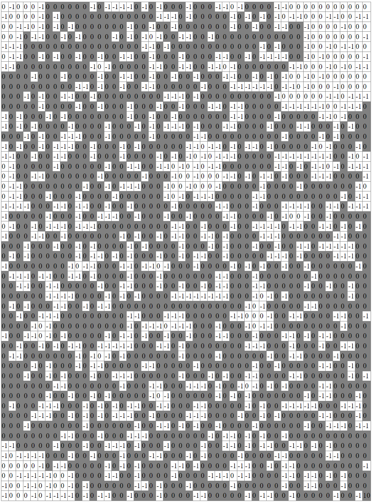

# Imitation Learning Algorithms Tutorial (Python)

This repository shows you the implementation examples of imitation learning (IL) from scratch in Python, with theoretical aspects behind code.

In this repository, I'll focus on the following 5 methods.

- [Behavior Cloning (BC)](01_bc.ipynb)
- [Dataset Aggregation (DAgger)](02_dagger.ipynb)
- [Maximum Entropy Inverse Reinforcement Learning (max-ent IRL)](03_maxent_irl.ipynb)
- [Relative Entropy Inverse Reinforcement Learning (rel-ent IRL)](04_relent_irl.ipynb)
- [Generative Adversarial Imitation Learning (GAIL)](05_gail.ipynb)

> Note : This repository only focuses on action-state learning, and trajectory learning (which is often applied in robotics) is out of scope. I don't also focus on model-based BC methods.<br>
> In trajectory learning, the trajectory is modeled by [GMM](https://github.com/tsmatz/gmm), [HMM](https://github.com/tsmatz/hmm-lds-em-algorithm), or MP (Movement Primitive), etc. (See [here](https://arxiv.org/abs/1811.06711) for details.)

There exist two main approaches for imitation learning - Behavior Cloning (BC) and Inverse Reinforcement Learning (IRL).<br>
Unlike [reinforcement learning](https://github.com/tsmatz/reinforcement-learning-tutorials), both approaches don't need prior reward's functions, but do need expert's behaviors.

**Behavioral Cloning (BC)** directly learns expert's (demonstrated) behaviors without reward functions, in which the optimal mapping from states to actions is explored. It simply finds optimal solution by solving a regression or classification problem using expert's behaviors (dataset) as a supervised learning problem.<br>
The examples of [Behavior Cloning (BC)](01_bc.ipynb) and [Dataset Aggregation (DAgger)](02_dagger.ipynb) belongs to this approach.

**Inverse Reinforcement Learning (IRL)**, on the other hand, is a method to learn a cost function, i.e, recovering the unknown reward function from expert's behaviors, and then extract a policy
from that cost function with reinforcement learning. In complex systems, it'll often be difficult to design with manual reward functions. In such cases, Inverse Reinforcement Learning (IRL) will come into play.<br>
The examples of [Maximum Entropy Inverse Reinforcement Learning](03_maxent_irl.ipynb) and [Relative Entropy Inverse Reinforcement Learning](04_relent_irl.ipynb) belongs to this approach.

[Generative Adversarial Imitation Learning (GAIL)](05_gail.ipynb) is the method inspired by Generative Adversarial Networks (GANs) and IRL, but unlike IRL, it constrains the behavior of the agent to be approximately optimal without explicitly recovering the reward's (or cost's) function.<br>
GAIL is the state-of-the-art imitation learning algorithm.

In this repository, I'll often use basic terminologies for behavioral learning - such as, discount, policy, advantages, etc.<br>
If you're new to learn behavioral learning, I recommend you to learn [Reinforcement learning (RL)](https://github.com/tsmatz/reinforcement-learning-tutorials) briefly at first.

Reinforcement learning (RL) has achived a great success in a wide variety of agent's and autonomous tasks. However, it's sometimes time-consuming and hard to learn from scratch in case of some complex tasks.<br>
The imitation learning makes sense in such complex systems, and a lot of prior works show us the benefits to provide prior knowledge to get optimal policy by imitation learning, before applying reinforcement learning directly.

> Note : There also exist a lot of works to learn policy from expert's behaviors in gaming - such as, [1](https://www.nature.com/articles/nature16961), [2](https://openai.com/blog/vpt/), or [3](https://developer.nvidia.com/blog/building-generally-capable-ai-agents-with-minedojo/).

## About environment and expert dataset

This repository includes expert dataset (```./expert_data/ckpt0.pkl```), which is trained by PPO (state-of-the-art RL algorithm) to solve GridWorld environment.

GridWorld is a primitive environment, but widely used for behavioral training - such as, reinforcement learning or imitation learning.<br>
The following is the game rule of GridWorld environment used in this repository. (This definition is motivated by the paper "[Relative Entropy Inverse Reinforcement Learning](https://proceedings.mlr.press/v15/boularias11a/boularias11a.pdf)".)

- It has 50 x 50 grids (cells) and the state corresponds to the location of the agent on the grid.
- The agent has four actions to move in one of the directions of the compass.
- When the agent reaches to the goal state (located on the bottom-right corner), a reward ```10``` is given.
- For the remaining states, the reward was randomly set to ```0``` with probability 2/3 and to ```−1``` with probability 1/3.
- The duration of each trajectory has maximum 200 time-step.
- If the agent tries to exceed the border, the fail reward (i.e, reward=```-1```) is given and the agent keeps the same state.
- The initial state is sampled from a uniform distribution on the states.

The following picture shows GridWorld environment used in this repository (which is generated with a fixed seed value, ```1000```).<br>
When the agent is on the gray-colored states, the agent can reach to the goal state without losing any rewards. (Thus the initial state is also selected among the gray-colored states.)



This repository also includes the script [00_generate_expert_trajectories.ipynb](./00_generate_expert_trajectories.ipynb) which is used to create expert model and expert dataset.<br>
By modifying and running this script, you can also customize and build your own expert demonstrations.

> Note : By setting ```transition_prob=True``` in environment's constructor, you can apply the transition probability - in which, the action succeeds with probability `0.7`, a failure results in a uniform random transition to one of the adjacent states (i.e, `0.1`, `0.1`, `0.1` respectively).<br>
> Dataset in this repository (```./expert_data/ckpt0.pkl```) is generated without transition probability (i.e, always transit to the selected direction deterministically).

*Tsuyoshi Matsuzaki @ Microsoft*
